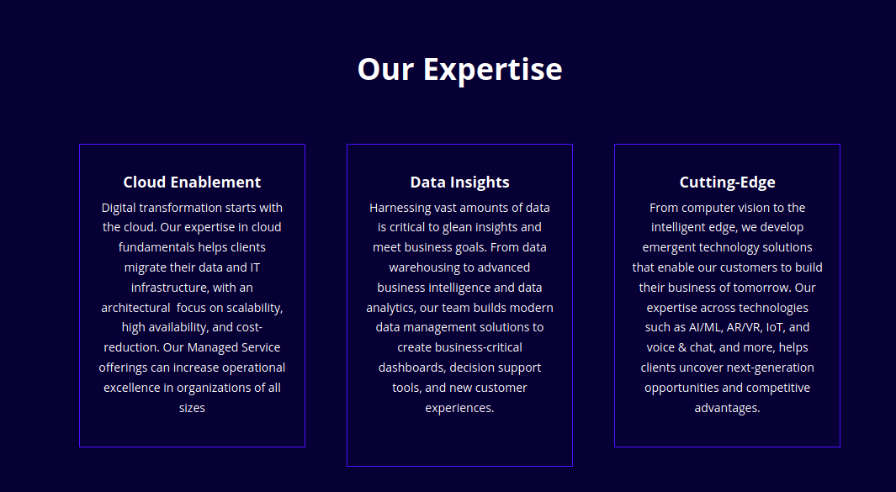

# WordPress Developer Assessment

The goal of this assessment is for us to take a look at how you write and organize your code. This is the most technical part of the Valence interview process, and we want to make sure that you are not under any stress and have plenty of time to complete this assessment.

## Project

Using CSS (via Tailwindcss) and Twig templating, duplicate the "Our Expertise" section of the [Valence Website](https://www.valencelevel.com/) as closely as you can but in the form of reusable Gutenberg blocks.



However, unlike the example above, each section within a row must be the same height so that the top and bottom of each section aligns. Each section must allow for any amount of text input by a user.

To assist with this a dev environment has been configured for easy setup and development. See the Local Development section below for more details.

## Guidelines

- Take as much time as you need
- Use Google as you normally would
- Not everything needs to be a Gutenberg block but the more reusable your code is the better
- Document any steps required for a user to replicate the WordPress page you created locally

To remove any potential bias, we will scrub any personally identifiable information from your submission before handing it over to an engineer for a code review.

## Submission

When you are finished, please perform the following steps:

1. Remove any personally identifiable information from the project and file headers (such as the name of the author, provisioning information, etc).
1. Zip up the code, excluding any build folders and npm packages.
1. Email your submission to your Valence recruiter.

## Evaluation Criteria

We are looking at the following things:

- Does the app compile and run?
- Are all the base features implemented?
- How well is your code organized?
- How closely does your styling match the example?
- How flexible are the Gutenberg blocks you created and how easily could they be reused elsewhere?
- How responsive is your CSS?
- How well did you use TailwindCSS and adapt to the new technologies in this project?
- Bonus: Did you implement any nifty hidden features or go above and beyond in some way?

## Local Development

### Setup

Local development requires the following:

- A recent version of NodeJS
- Docker (docker-ce on Linux)
- Docker Compose (included with Docker for Windows and Mac)

Once everything is installed run `npm i` to download all dependencies.

**Windows Users:** Make sure that `docker/wpcli/entrpoint.sh` has LF line endings and not CLRF. Due to all code being run inside Linux Docker containers, using CLRF for executable files will cause problems.

### Folder Structure

All code is contained in the `src/` folder.

- `src/scripts` contains all JavaScript
- `src/styles` contains all CSS
- `src/wp-content/plugins` contains all WordPress plugins that should be installed
- `src/wp-content/themes/test-theme` contains the main WordPress theme used to build the website

### Docker

The main stack can be started by running `docker-compose up -d`. This will bring up everything needed to run WordPress and automatically setup WordPress for local development. This will also make sure that the correct theme is being used and all plugins are activated. Note that it may take a minute for everything to be configured after the initial start-up.

If it your first time running the project you will need to make sure all CSS an JS has been generated. To do so, follow the directions in the next section, or for one time use run `npm run build`.

The default admin login is `admin` and the password is `password`.

### Making Changes

This project is setup for live code reloading. To get started run `npm start`.

The main WordPress theme uses [Timber](https://github.com/timber/timber) with [twig templating](https://twig.symfony.com/).

All styles take advantage of [PostCSS](https://postcss.org/) and [Tailwind CSS](https://tailwindcss.com/).

JavaScript development uses the WordPress included version of jQuery, however, thanks to Babel and Webpack we can use modern JS development for site functionality.

All CSS and JS will be transpiled to support our browser targets, though polyfills may occasionally be required. The current browser requirements are:

- Last two versions of Chrome for Android and desktop
- Last two versions of FireFox
- Last two versions of Edge
- Latest version of Safari for iOS and desktop

However, there is a subset of users who do not fall within our official requirements so we try to maintain as much compatibility as possible and fail gracefully.

### Lazy Blocks

The way Gutenberg blocks are created in this project is through the use of [Lazy Blocks](https://wordpress.org/plugins/lazy-blocks/). All lazy block files must be placed in the `src/wp-content/themes/test-theme/views/blocks` folder.

To setup a new block:

1. Find the `Lazy Blocks` section in the WordPress admin
1. Select `Blocks` to navigate to the Blocks page
1. Click `Add New` near the top of the page
1. Add any controls necessary, taking careful note of the `name` property. This is how you will refer to this control within your code
1. In the settings, set the `Title` and `Slug` of the Block
1. Once you're happy click `Publish`. Note that you can always update your block later
1. Create a a new twig file within the `blocks` folder. The set control values can be referenced by including `{{attrs.control-name}}`
1. To make the block visible within the admin UI modify the `block-definitions.php` file with a mapping of block slug to file name. For example if you created a `sample` block and a `blocks/sample.twig` file your `block-definitions.php` file would look like this:

```php
<?php
 return array(
  array("sample", "sample.twig"),
);
```

An example Lazy Block called `sample-container` has already been created and can be imported by importing the `lzb-export-blocks.json` file within the Lazy Blocks admin page. Feel free to reuse and modify this block.

### Adding Plugins

Plugins can be added to `wp-plugins.txt` and they will be guaranteed installed on start-up. When adding a plugin to the list make sure that it is added by its name in the wordpress.org URL and not its display name. For example, if you wanted to add Timber, its wordpress.org URL is https://wordpress.org/plugins/timber-library so timber-library would be the value to use. Plugins can still be installed the traditional way through WordPress but they will not be synchronized.
